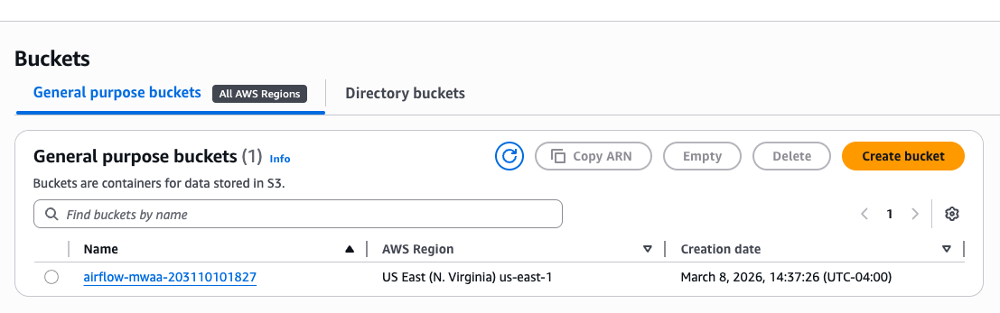
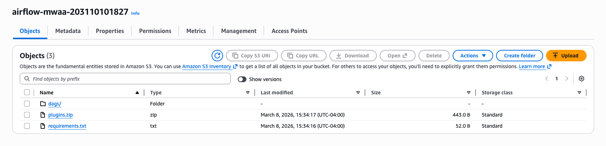
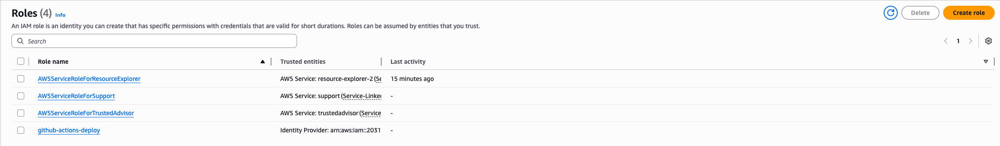
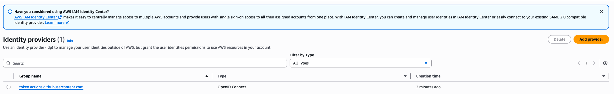
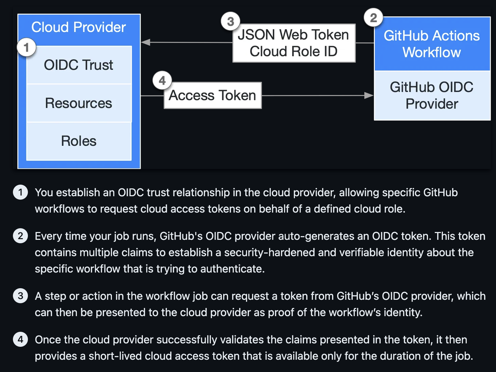

# AWS

Learning AWS + Terraform from scratch, focused on data engineering.

## Project Structure

```text
terraform/          Terraform configs (infrastructure as code)
docs/               Step-by-step learning guides
docs/aws/           AWS service reference docs
.claude/            Learning path and memory
```

## AWS Resources Created

| Resource | Name | Purpose |
| -------- | ---- | ------- |
| S3 Bucket | `airflow-mwaa-203110101827` | Stores DAGs and requirements.txt for MWAA |
| OIDC Provider | `token.actions.githubusercontent.com` | Lets AWS trust GitHub Actions identity tokens |
| IAM Role | `github-actions-deploy` | Temporary identity for GitHub Actions CI/CD |
| VPC | `mwaa-vpc` | Private network for MWAA |
| Subnets | 2 public + 2 private | Across 2 AZs for high availability |
| Internet Gateway | `mwaa-igw` | VPC's door to the internet |
| NAT Gateway | `mwaa-nat` | Lets private subnets reach the internet outbound |
| Security Group | `mwaa-sg` | Firewall rules for MWAA components |
| IAM Role | `mwaa-execution-role` | Permissions MWAA needs to access S3, logs, SQS |
| MWAA Environment | `airflow-mwaa` | The managed Airflow instance |
| EC2 Instance | `airflow-mwaa-ec2` | Free-tier t2.micro for learning |
| Security Group | `ec2-sg` | Firewall for EC2 (SSH + HTTP) |

### Architecture

```text
                        Internet
                           |
                    Internet Gateway
                           |
                    +--------------+
                    |     VPC      |
                    |  10.0.0.0/16 |
                    +--------------+
                    |              |
         us-east-1a              us-east-1b
                    |              |
         +----------+  +----------+
         | Public   |  | Public   |
         | Subnet A |  | Subnet B |
         | [NAT GW] |  |          |
         +----+-----+  +----------+
              |
         +----+-----+  +----------+
         | Private  |  | Private  |
         | Subnet A |  | Subnet B |
         |  [MWAA]  |  |  [MWAA]  |
         +----------+  +----------+
```

### Screenshots







## AWS Service Reference

| Service | Doc |
| ------- | --- |
| IAM | [docs/aws/1_iam.md](docs/aws/1_iam.md) |
| S3 | [docs/aws/2_s3.md](docs/aws/2_s3.md) |
| EC2 | [docs/aws/3_ec2.md](docs/aws/3_ec2.md) |
| VPC & Networking | [docs/aws/4_networking.md](docs/aws/4_networking.md) |
| Security Groups | [docs/aws/5_security_group.md](docs/aws/5_security_group.md) |
| OIDC | [docs/aws/6_oidc.md](docs/aws/6_oidc.md) |
| MWAA | [docs/aws/7_mwaa.md](docs/aws/7_mwaa.md) |

## Learning Guides

1. [AWS Account Setup](docs/01-aws-account-setup.md)
2. [IAM User Setup](docs/02-iam-user-setup.md)
3. [AWS CLI & Terraform Setup](docs/03-aws-cli-terraform-setup.md)
4. [Terraform Basics](docs/04-terraform-basics.md)
5. [Terraform S3 Syntax Breakdown](docs/05-terraform-aws-s3.md)
6. [Terraform OIDC Provider Breakdown](docs/06-terraform-aws-iam-oidc.md)
  7. [Terraform IAM Role Breakdown](docs/07-terraform-aws-iam-role.md)

## Related Project

- [`airflow_mwaa`](../airflow_mwaa) - CI/CD with Airflow on Amazon MWAA (deploys to the S3 bucket above)
